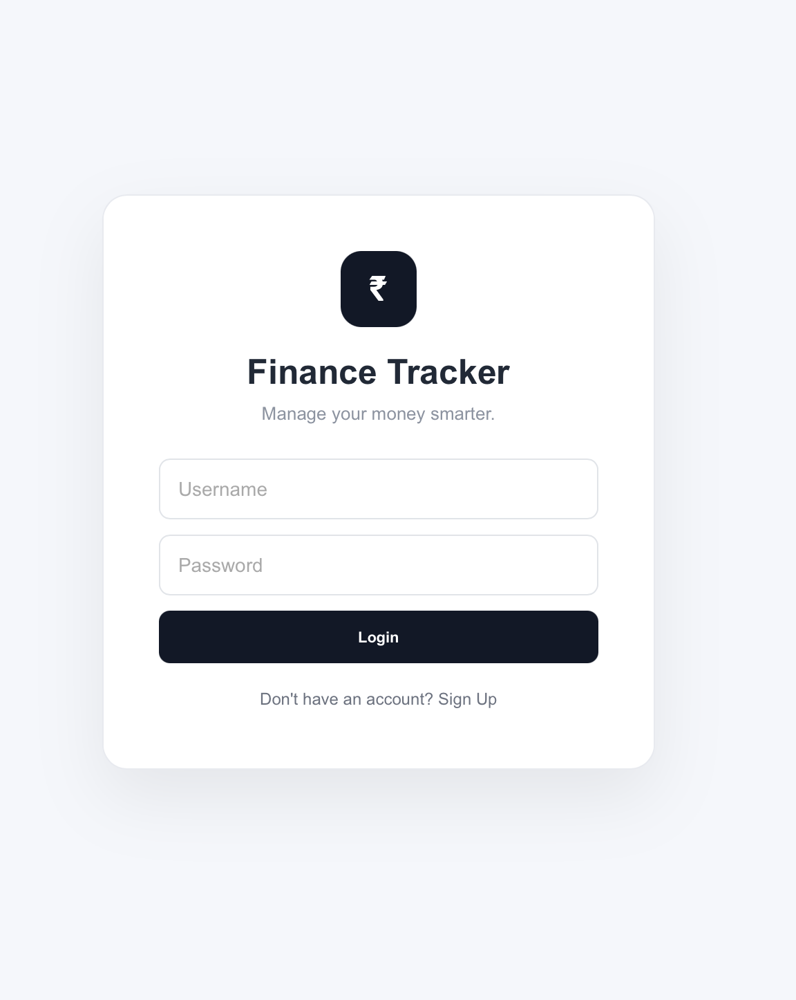
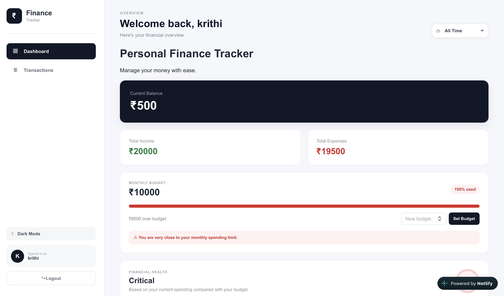
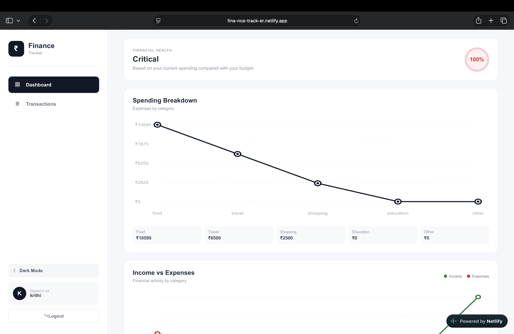
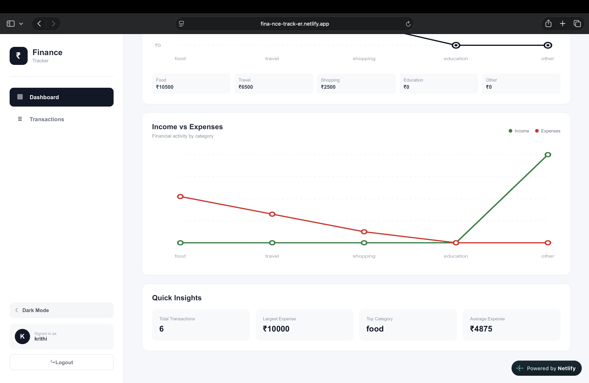
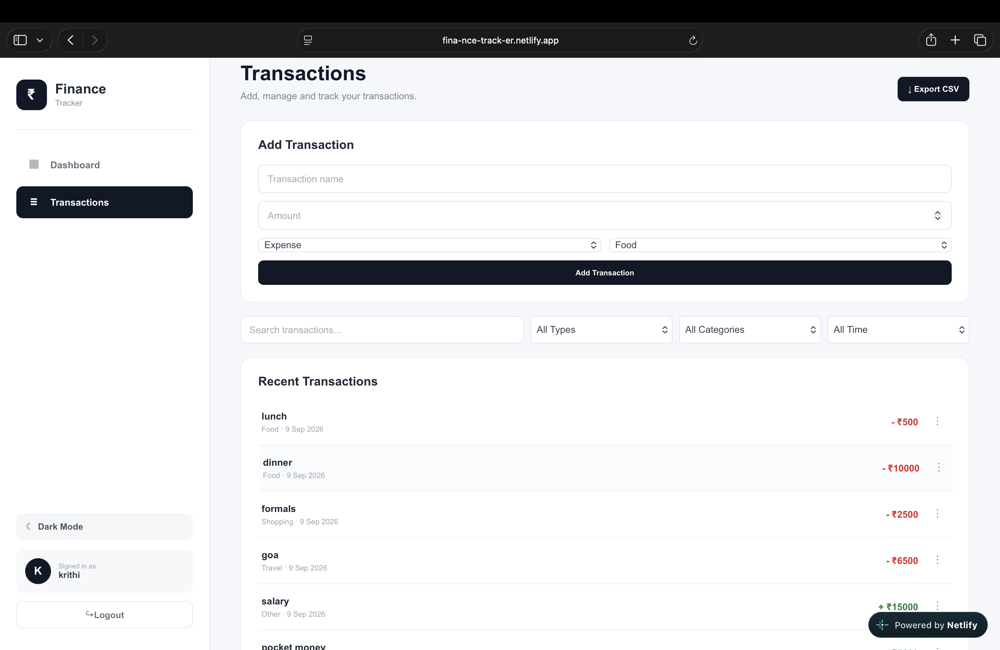

# 💰 Finance Tracker

A modern **Personal Finance Tracker** built with **React and Vite** to help users manage their income, expenses, budgets, and spending patterns through a clean and interactive dashboard.

🔗 **Live Demo:**https://fina-nce-track-er.netlify.app
🔗 **GitHub Repository:** https://github.com/krithikssha/finance-tracker

---

## ✨ Features

### 🔐 User Authentication

* User login and signup
* Separate financial data for different users
* Logout functionality
* User data persisted using browser `localStorage`

### 📊 Financial Dashboard

* Current balance overview
* Total income
* Total expenses
* Monthly budget tracking
* Remaining budget calculation
* Financial health indicator
* Quick financial insights

### 💳 Transaction Management

* Add new transactions
* Edit existing transactions
* Delete transactions
* Duplicate transactions
* Income and expense classification
* Transaction categories
* Automatic transaction dates

### 📈 Spending Analytics

* Spending breakdown by category
* Income vs. expenses visualization
* Largest expense
* Average expense
* Top spending category
* Total transaction count

### 🔎 Search & Filtering

* Search transactions by name
* Filter by income or expense
* Filter by spending category
* Filter transactions by date

  * All Time
  * This Month
  * Last Month

### 📤 Data Export

* Export transaction data as a CSV file

### 🌙 Dark Mode

* Light and dark interface
* Responsive styling across different screen sizes

---

## 🛠️ Tech Stack

### Frontend

* **React**
* **JavaScript (JSX)**
* **HTML5**
* **CSS3**

### Development

* **Vite**
* **ESLint**
* **npm**

### Data Storage

* **Browser LocalStorage**

### Deployment

* **Netlify**
* **GitHub**

---

## 📁 Project Structure

```text
finance-tracker/
│
├── public/
│   ├── favicon.svg
│   └── icons.svg
│
├── src/
│   ├── assets/
│   │   ├── hero.png
│   │   ├── react.svg
│   │   └── vite.svg
│   │
│   ├── components/
│   │   ├── BalanceCard.jsx
│   │   ├── DashboardStats.jsx
│   │   ├── Header.jsx
│   │   ├── SpendingBreakdown.jsx
│   │   ├── Summary.jsx
│   │   ├── TransactionForm.jsx
│   │   ├── TransactionItem.jsx
│   │   └── TransactionList.jsx
│   │
│   ├── App.jsx
│   ├── App.css
│   ├── index.css
│   └── main.jsx
│
├── index.html
├── package.json
├── package-lock.json
├── vite.config.js
└── README.md
```

---

## 🚀 Getting Started

### 1. Clone the repository

```bash
git clone https://github.com/krithikssha/finance-tracker.git
```

### 2. Navigate into the project

```bash
cd finance-tracker
```

### 3. Install dependencies

```bash
npm install
```

### 4. Start the development server

```bash
npm run dev
```

The application will be available at the local development URL provided by Vite.

---

## 🏗️ Build for Production

Create an optimized production build:

```bash
npm run build
```

To preview the production build locally:

```bash
npm run preview
```

---

## 🌐 Deployment

The project is deployed using **Netlify**.

To create a production build and deploy through the Netlify CLI:

```bash
npm run build
npx netlify deploy --prod
```

---

## 💡 How It Works

The application follows a component-based React architecture.

The main `App` component manages the application's state, while individual components handle specific parts of the interface.

```text
App
│
├── Header
├── BalanceCard
├── Summary
├── SpendingBreakdown
├── DashboardStats
├── TransactionForm
└── TransactionList
    └── TransactionItem
```

Transactions are stored in React state and persisted in the browser using `localStorage`, allowing data to remain available when the user refreshes or returns to the application.

---

## 📊 Transaction Categories

The application currently supports:

* 🍔 Food
* ✈️ Travel
* 🛍️ Shopping
* 📚 Education
* 📦 Other

Each transaction can be classified as either:

* **Income**
* **Expense**

---

## 🎯 Project Goals

The main goals of the project are to:

* Provide a simple way to track personal finances
* Make income and spending easy to understand
* Visualize spending patterns
* Encourage better budgeting habits
* Demonstrate practical React development
* Build a responsive and user-friendly web application

---

## 🔮 Future Improvements

Possible future enhancements include:

* ☁️ Cloud database integration
* 📱 Progressive Web App (PWA) support
* 📊 More advanced financial analytics
* 📅 Custom date-range filtering
* 🔔 Budget notifications
* 📄 PDF financial reports
* 🔐 More secure authentication
* 💱 Multiple currency support
* 📈 Advanced interactive charts
* 🤖 AI-powered spending insights

---

## 👨‍💻 Author

**Krithikssha Mahendran**

Built as a personal finance management project using React and Vite.

---

## 📄 License

This project is intended for educational and portfolio purposes.

## 📸 Screenshots
### Login


### Dashboard



### Dashboard



### Dashboard




### Dashboard

